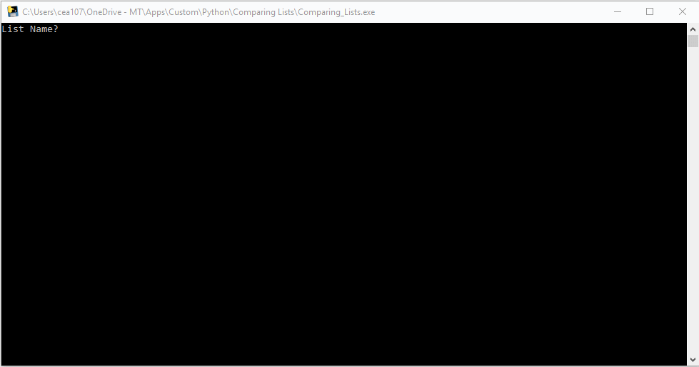
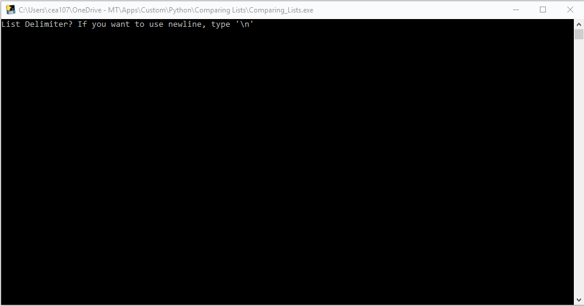
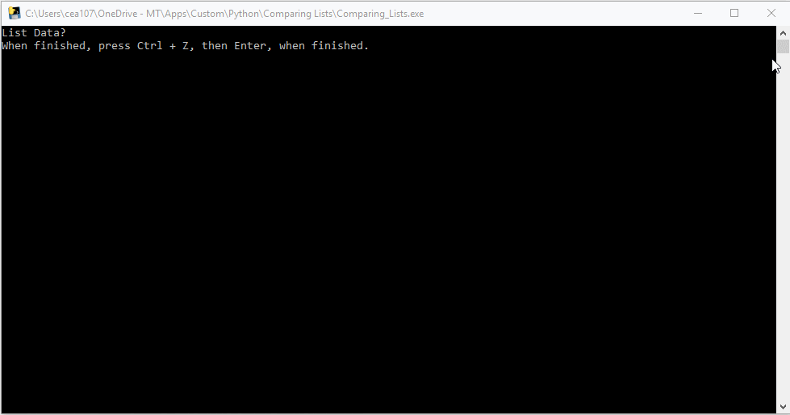
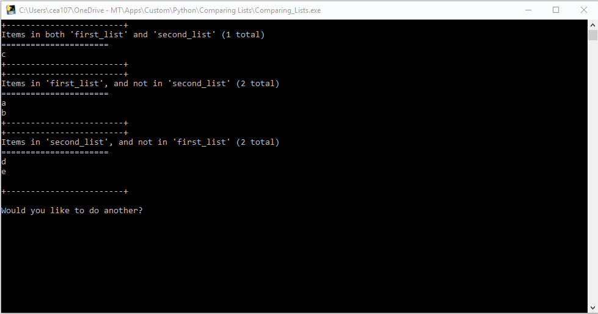

# ComparingLists
A small python utility program I wrote for the rare instances where I just need to compare two lists of data.

Compiled to an .exe thanks to [Brent Vollebregt](https://github.com/brentvollebregt)'s awesome [auto-py-to-exe](https://github.com/brentvollebregt/auto-py-to-exe) project. Thanks Brent!

## Usage

1. Run the program
  * If using the .exe, double click it.
  * If using the ComparingLists.py open a terminal and run:
  ```bash
  python ComparingLists.py
  ```
2. Provide the name of the first list:


3. Provide the first list delimiter:


4. Provide first list data:


5. Provide the name of the second list:



6. Provide the second list delimiter:



7. Provide second list data:



8. Review results and determine if you'd like to go again (Anything that doesn't start with a 'y' is taken as a No.):


