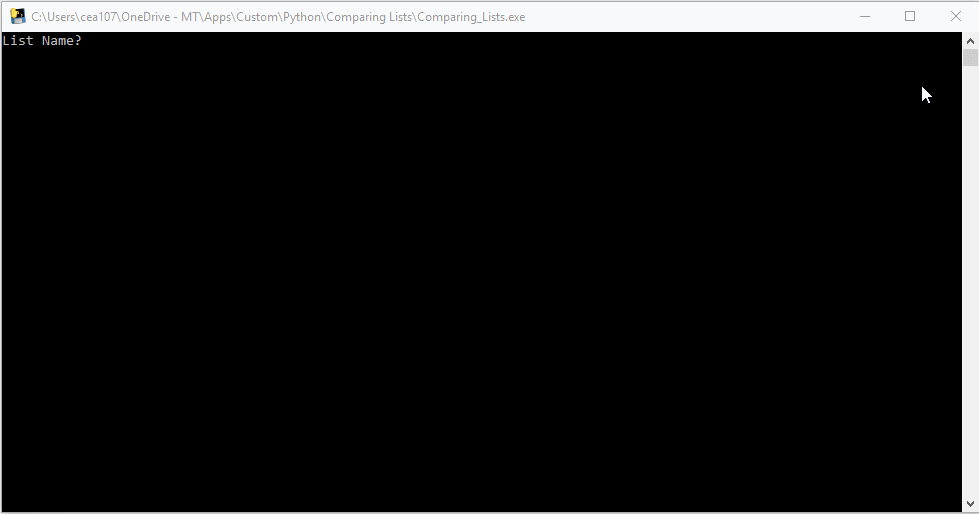
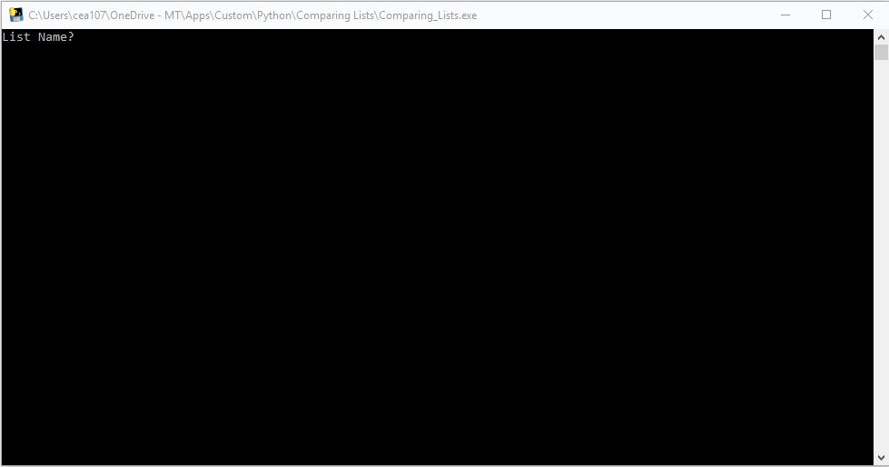
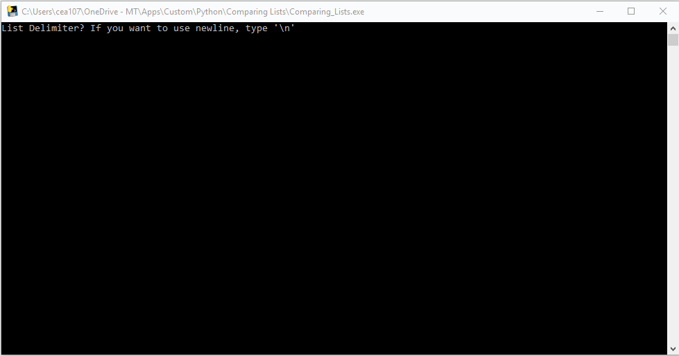
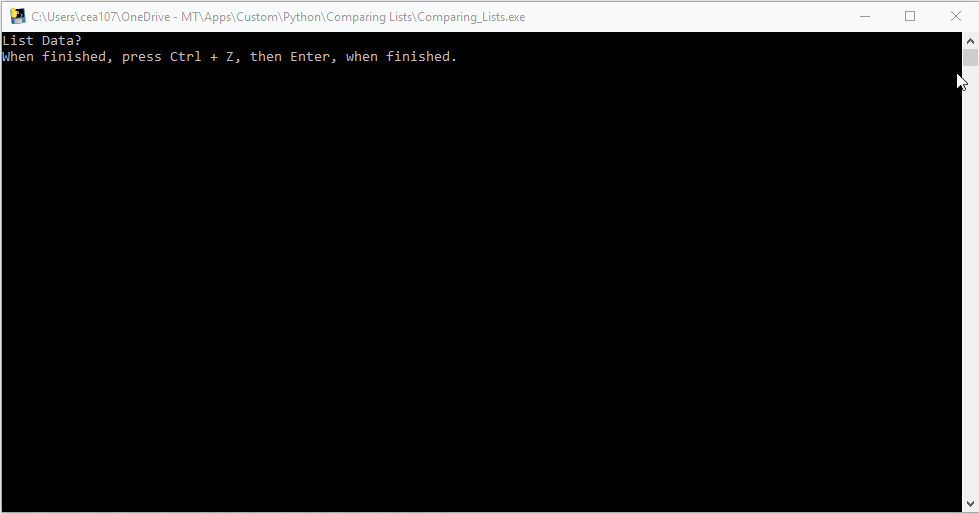
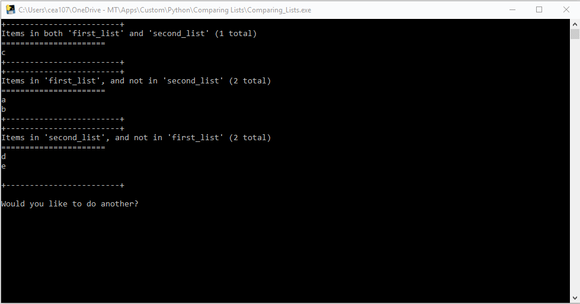

===============
comparing_lists
===============

.. image:: https://img.shields.io/pypi/v/comparing_lists.svg
        :target: https://pypi.python.org/pypi/comparing_lists

.. image:: https://img.shields.io/travis/William-Lake/comparing_lists.svg
        :target: https://travis-ci.org/William-Lake/comparing_lists

.. image:: https://readthedocs.org/projects/comparing-lists/badge/?version=latest
        :target: https://comparing-lists.readthedocs.io/en/latest/?badge=latest
        :alt: Documentation Status

A small python utility program I wrote for the rare instances where I just need to compare two lists of data.

* Free software: MIT license
* Documentation: https://comparing-lists.readthedocs.io.

Usage
--------

#. Run the program
  - If using the .exe, double click it.
  - If using the ComparingLists.py open a terminal and run:

  .. code:: bash

        python ComparingLists.py
  
#. Provide the name of the first list:

#. Provide the first list delimiter:

#. Provide first list data:

#. Provide the name of the second list:

#. Provide the second list delimiter:

#. Provide second list data:

#. Review results and determine if you'd like to go again (Anything that doesn't start with a 'y' is taken as a No.):

Credits
-------

This package was created with Cookiecutter_ and the `audreyr/cookiecutter-pypackage`_ project template.

.. _Cookiecutter: https://github.com/audreyr/cookiecutter
.. _`audreyr/cookiecutter-pypackage`: https://github.com/audreyr/cookiecutter-pypackage
